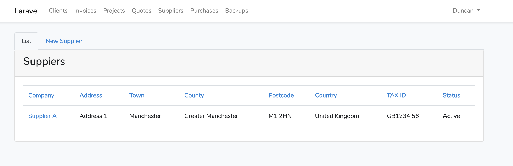

# Laravel ^7.2 Suppliers Package

Welcome to the Suppliers package for Laravel ^7.2, which delivers a complete supplier management package.

This package is desinged to be used with other packages offered by DRMorris IT Services, for more information check out https://github.com/DRMorris-IT-Services

